# better-newtab

A fully customizable start page for your browser served locally, this is fast as f***

## Features
*   **Customizable UI:** Draggable and resizable.
*   **Theming:** Dark/Light modes, blur effects, and icon shapes.
*   **Dynamic Backgrounds:** Random local images or videos.
*   **Search:** Multi-engine support with autocomplete suggestions.
*   **Shortcuts:** Pinned sites and Google Apps menu.
*   and many more...

## Prerequisites
*   Python 3.x ( To host server )

## Server Setup

> [!CAUTION]
> Delete `background.js` from `src/js` and rename `background.js.local` -> `background.js`.
> 
> The current `background.js` fetches media stored on my `wallpaper-api` repository.

1.  **Download the repository**

2.  **Configure Paths:** Open `api.py` and update the `HTML_DIR` and `MEDIA_DIR` variables for your OS:

3.  **Start the Server**
    ```
    python api.py
    ```
    The server runs at `http://localhost:4000/index.html`.

## Browser Configuration

### Windows & macOS
To set this local page as your new tab: (You can set the policy to browser if you want this will give you clean look) or,
1.  Install a "New Tab URL" extension for your browser (e.g., Firefox [link1](https://addons.mozilla.org/en-US/firefox/addon/newtaburl/?utm_source=addons.mozilla.org&utm_medium=referral&utm_content=search), [link2](https://addons.mozilla.org/en-US/firefox/addon/new-tab-changer/?utm_source=addons.mozilla.org&utm_medium=referral&utm_content=search) for Chrome/Edge [link1](https://chromewebstore.google.com/detail/change-new-tab/mocklpfdimiadpbgamlgehpgpodggahe)), [link2](https://chromewebstore.google.com/detail/custom-new-tab-url/mmjbdbjnoablegbkcklggeknkfcjkjia).
2.  Set the URL to: `http://localhost:4000/index.html`


### Linux (No Extension Required)
Linux users can configure browser policies directly to set the new tab page without extensions. (only for chromium based browsers)

1.  Create a `managed.json` file in the directory corresponding to your browser (create the folders if they don't exist):

    *   **Chromium:** `/etc/chromium/policies/managed/`
    *   **Chrome:** `/etc/opt/chrome/policies/managed/`
    *   **Edge:** `/etc/opt/edge/policies/managed/`
    *   **Brave:** `/etc/brave/policies/managed/`

2.  Paste the following content into `managed.json`:
    ```json
    {
      "HomepageIsNewTabPage": true,
      "NewTabPageLocation": "http://localhost:4000/index.html"
    }
    ```

    For Brave Browser you can use this if you want

    ```json
    {
      "BraveRewardsDisabled": true,
      "BraveWalletDisabled": true,
      "BraveVPNDisabled": 1,
      "BraveAIChatEnabled": false,
      "HomepageIsNewTabPage": true,
      "NewTabPageLocation": "http://localhost:4000/index.html",
      "TorDisabled": true,
      "PasswordManagerEnabled": false,
      "DnsOverHttpsMode": "automatic"
    }
    ```

---

## Preview

| | |
|-|-|
|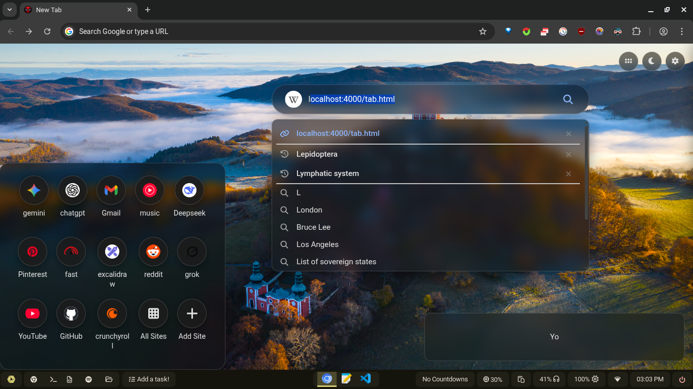|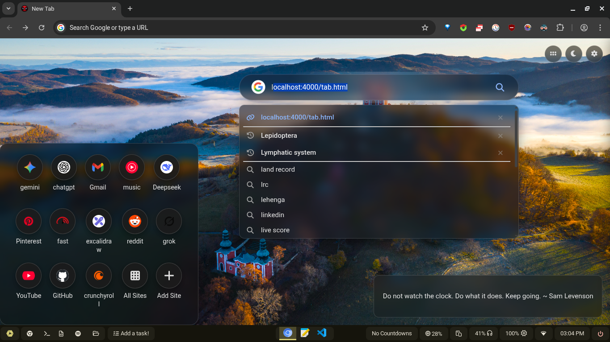|
|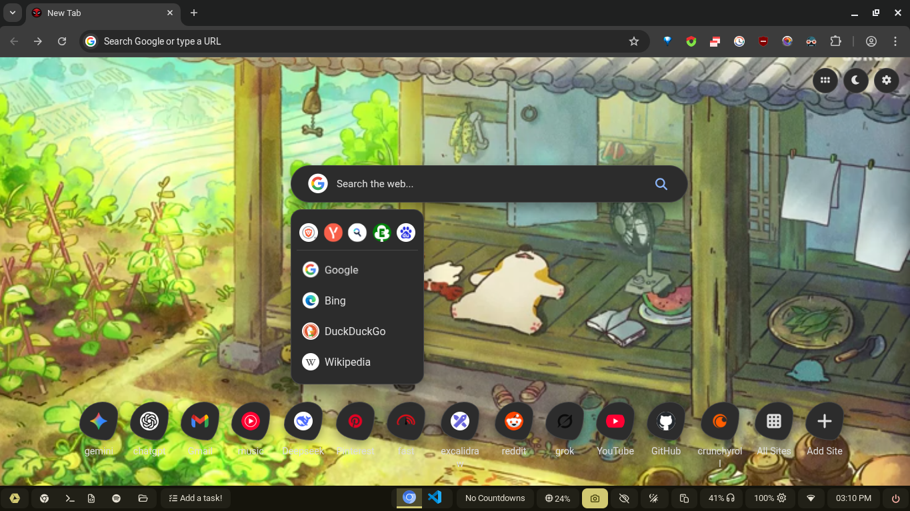|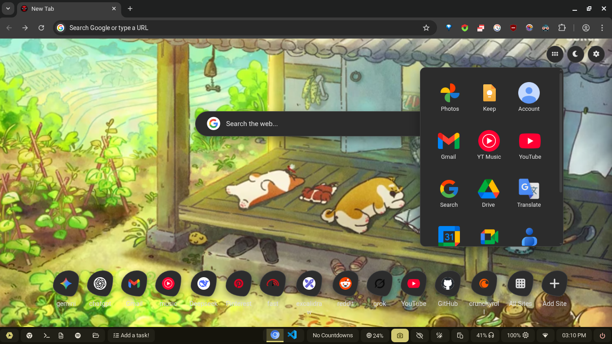|
|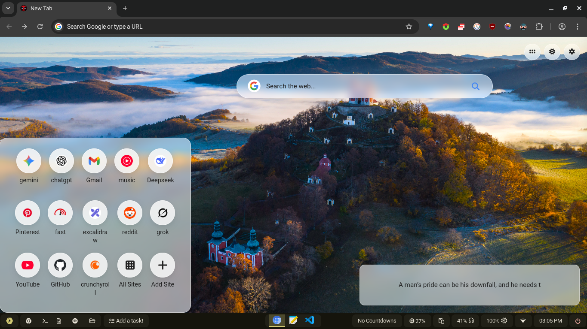|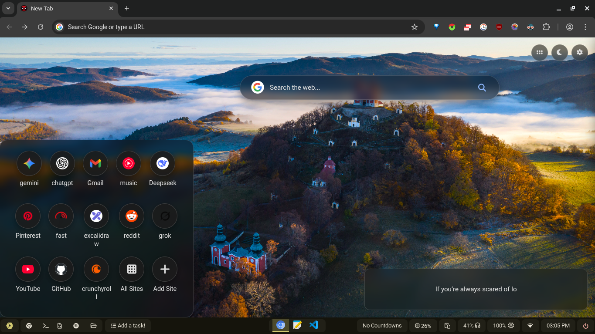|
|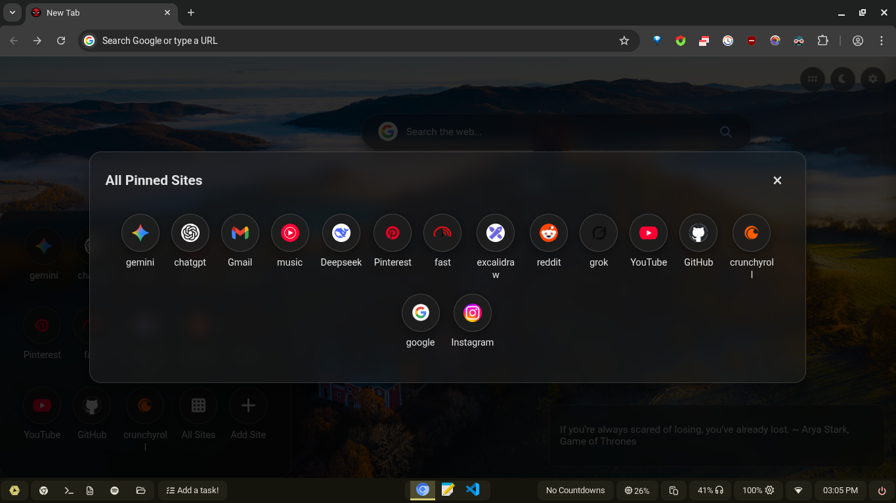|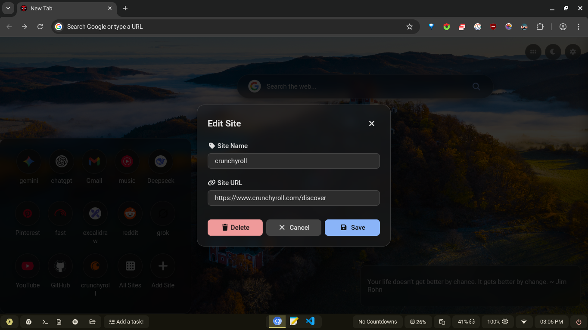|
||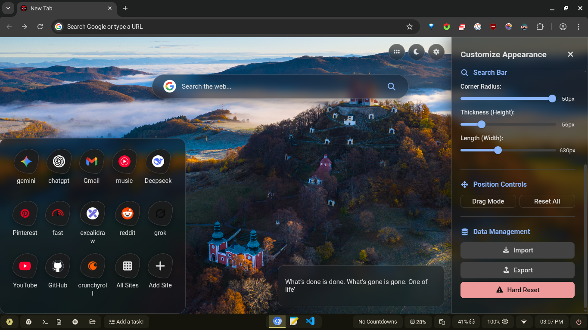|
|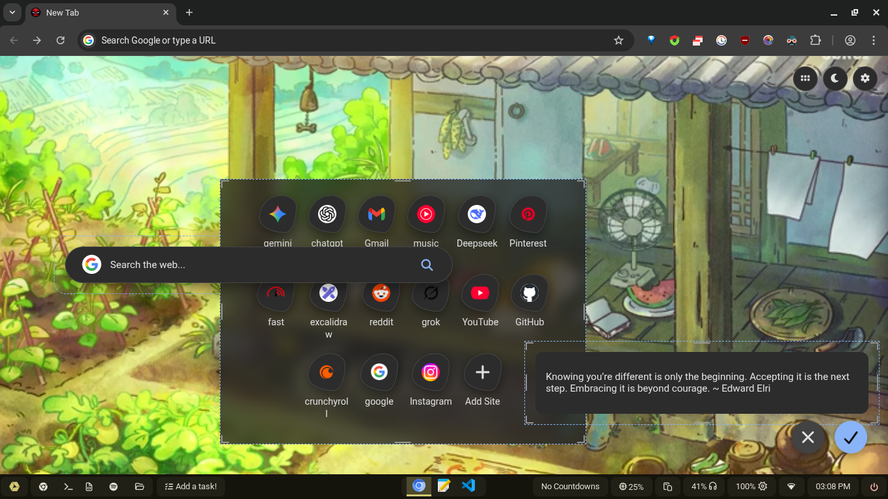|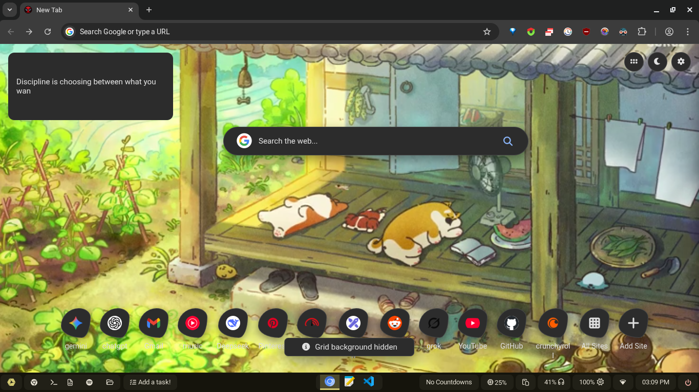|
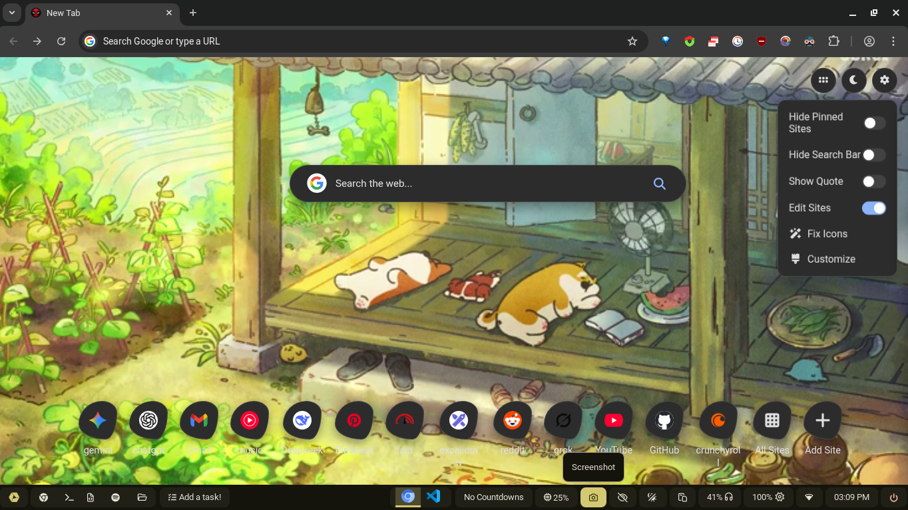
